# Relatório 25: Reconstrução de Viewport e Scroll Dual

## O Que Foi Feito

1. **Correção Global de Viewport**: Modificamos o container principal `<motion.div>` para ser estrito (`h-screen`). Agora, em vez de herdar alturas imprecisas do navegador, ele se delimita perfeitamente na janela oferecendo sua rolagem (`overflow-y-auto`) e os espaçamentos inferores relaxados (`pb-20`).
2. **Estilização Card de Convidados (Pai)**: O bloco externo da tabela recebeu o fechamento finalizado do design Glassmorphism (classes `bg-white/10`, `backdrop-blur-md`, `rounded-2xl`, `border-white/20`, `p-6` e `shadow-2xl`).
3. **Scroll Dual Habilitado**: A *div* envolvendo estritamente a tabela ganhou novamente as regras forçadas de exibição:
   * `style={{ height: '400px', overflowY: 'auto' }}` e `display: block` restabeleceram o volume nativo gerando scrollbar interna (sem estourar as extremidades do container global).
4. **Header Sticky**: A tag `<thead>` permanece isolada com `sticky top-0` garantindo a persistência do Header da Tabela durante a rolagem de grandes Listas VIP.

## Arquitetura de Hierarquia - Viewport Dual

```mermaid
graph TD
    A["<motion.div> (Page Viewport h-screen)"] --> B["Grid Layout (12 cols)"]
    B --> C["Col Left (span 4): Novo Convidado"]
    B --> D["Col Right (span 8): Card Mestre Convidados"]
    
    style D fill:#1e3a8a,stroke:#3b82f6
    
    D -->|"bg-white/10, rounded-2xl, p-6"| E["Máscara Overflow Hidden"]
    E -->|"border-white/10"| F["Scroll Container Mestre"]
    
    style F fill:#0f172a,stroke:#38bdf8
    
    F -->|"height: 400px, overflow-y: auto"| G["<table>"]
    G -->|"sticky top-0 z-20"| H["<thead> bg-black/80 blur"]
    G --> I["<tbody> (Rows VIP)"]
```

Com este modelo de Scroll Dual, o usuário agora tem o conforto de deslizar a lista local sem tirar o foco da página, mas se a tela for pequena ele pode deslizar globalmente também.

## Arquivos Afetados
* `frontend/src/Detalhes.jsx`: Mapeamento das camadas de layout descritas no organograma.
